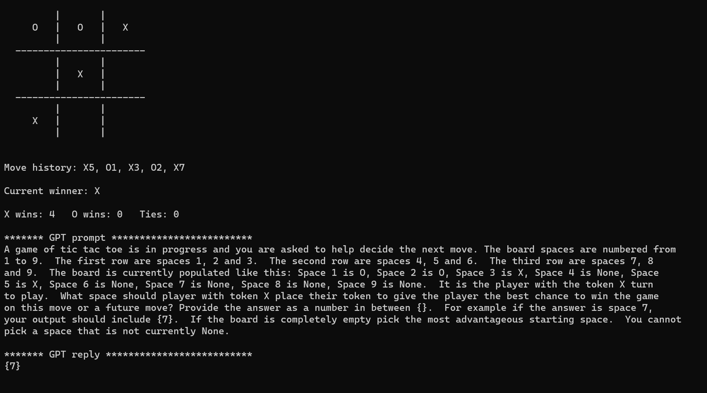

# AI Tic Tac Toe
Docs 8-28-23 V1 (For questions or comments:  Stephen Witty switty@level500.com)  

### Project Overview:

With a tip of the hat to the 1983 movie WarGames, this project seeks to force ChatGPT to play continuous games of Tic-Tac-Toe against itself or in WarGames vernacular - Number of Players Zero.  Stats are kept throughout gameplay and displayed.  Each move in the game is a new ChatGPT prompt and its corresponding answer on what it thinks is the best move.   ChatGPT is both players in the game.  Python is used with the OpenAI API to drive gameplay while also storing board and game results.

### Demo Video:
https://www.youtube.com/watch?v=2nmLmqTtfCw&t=72s

### Usage:

- The software is a Python3 script and runs in the usual manner
- There is only one source code/script file
- A user must first install the OpenAI Python API (Google for instructions)
- User must enter their OpenAI API key toward the top of the Python script
- The GPT model can be selected also in the source file
- Under Constants - assign the number of games to play
- Set Linux or not via True/False - this drives the command that clears the screen
- CLEAR_SCREEN - True/False - If set to False, the script output could be redirected to a file for study